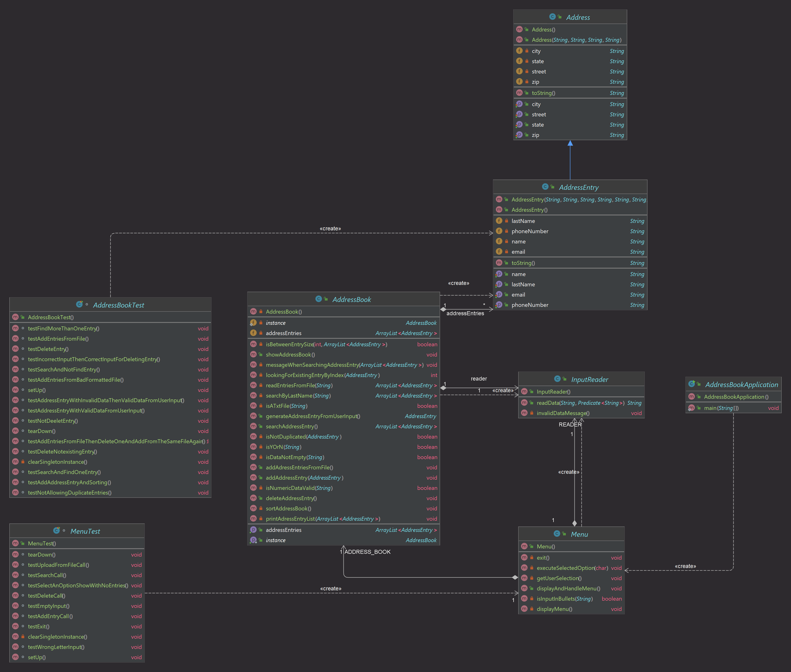

https://docs.github.com/en/get-started/writing-on-github/getting-started-with-writing-and-formatting-on-github/basic-writing-and-formatting-syntax

# Descripción
The project is an Address Book Application that allows users to manage personal contact information through addresses entries. Users can:
- Perform essential operations such as adding, deleting, searching, and displaying address entries.
- Interact with the address book through various menu options in the CLI.

This Java application reads and writes contact information, including name, address, email, and phone number. The primary goal of this project is to offer a tool tha manages contacts info demonstrating key programming concepts such as object-oriented design, file handling, user input validation, and data structure management in Java.
## System state
System works as expected, providing key functionalities for managing address entries. However, I'm aware that there's space from improvement by implementing more advanced data structures or more efficient search and sorting algorithms that I didn't include because I still need to learn more about it.
#### Working:
- Loading entries from a file: The system can read address entries from a text file and add them to the address book.
- Adding entries: Users can add new entries by providing the necessary information.
- Deleting entries: Users can search and delete entries from the address book.
- Searching for entries: Users can search for entries by last name or the first few letters of the last name.
- Displaying all entries: The system can display all entries in the address book.

### Not working:
- All functionalities work, but they can improve in the data validation and error handling.

## List of classes
### adress.data
1. **Address**
    -  _Purpose:_ It represents the contact's address itself without mixing the rest of the contact's personal information.
    - _Data structures/Algorithms:_ Uses string attributes to store data even if they're numbers, I decided this to prevent the possibility to do operations with them.
2. **AddressEntry**
    - _Purpose:_ This class includes more information about the contact, such as name, last name, email and phone number. It represents an entry from the `AddressBook`
    - _Data structures/Algorithms:_ Extends the `Address` class. I decided this structure to inherit `Adress` attributes easily through the `super()`.
3. **InputReader**
    - _Purpose:_ Handles user data input, validating and reading data based on a prompt message and a provided validator.
    - _Data structures/Algorithms:_ Uses a `Scanner` to read user input and `Predicate < String >` to validate the data. I decided this to avoid the repetition of code that handle user input.
4. **AddressBook**
    - _Purpose:_ Maintains and manages a list of address entries (AddressEntry). Implements CRUD (Create, Read, Update, Delete) operations.
    - _Data structures/Algorithms:_
        - Singleton instance.
        - ArrayList:  Uses an ArrayList to store entries.
        - Sorting: Utilizes `Collections.sort` with a `Comparator` to sort entries by last name and first name.
        - Uses `InputReader` in the methods that needs the input to execute certain action.

### address
5. **Menu**
    - _Purpose:_ Handles an `AdressBook`. It's the interface that the user can interact with. It displays menu option and the user inputs the option for the action they want to perform.
    - _Data structures/Algorithms:_
        - Infinite Loop: Uses an infinite loop to display the menu and handle user selections until the user chooses to exit.
        - Uses `InputReader` to manage the user's input when selecting an option.
6. **AddressBookApplication**
    - _Purpose:_ Main class that starts the application and displays the menu.
    - _Data structures/Algorithms:_ Creates an instance of `Menu` and calls `displayAndHandleMenu()` method that executes infinitely until the user exits the application.

# [JavaDoc URL](https://zuzzet514.github.io/Hernandez_LibretaDirecciones/)

# UML Class Diagram

# System screenshots
▪ Sección D: Capturas de pantalla del sistema: capturas de pantalla que muestran
su aplicación funcionando para los siguientes casos:
o D.1) Evidencia 1: Leer entradas del archivo de datos seguidas de Mostrar
listado. El archivo de datos debe contener un mínimo de 2 direcciones. Incluir
captura de pantalla de salida y también mostrar el contenido correspondiente
del archivo de datos
o D.2) Evidencia 2: inmediatamente después de D.1, agregue un nuevo objeto
AddressEntry seguido de un mostrar el resultado de un nuevo listado en
consola
o D.3) Evidencia 3: inmediatamente después de D.2 hacer una eliminación de
una entrada seguida de un mostrar listado
o D.4) Evidencia 4: inmediatamente siguiendo D.3 hago una búsqueda usando
una entrada que debería recuperar al menos una entrada. Ahora haga una
búsqueda usando una entrada que no debería recuperar ninguna entrada.
Coloque capturas de pantalla de cada hallazgo aquí
